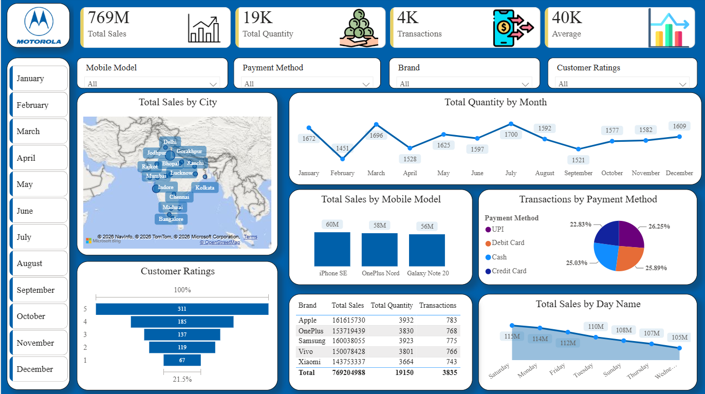

# Mobile-Sales-Data-Dashboard-PowerBI
Interactive Mobile Sales Data Dashboard developed using Microsoft Power BI to analyze sales, quantity, transactions, brands, mobile models, payment methods, customer ratings, and geographic performance.

# 📱 Mobile Sales Data Dashboard | Power BI

An interactive **Mobile Sales Data Dashboard** developed using **Microsoft Power BI** to analyze mobile sales performance and generate meaningful business insights.

## 📊 Dashboard Preview

## 🎯 Project Objective

The objective of this project is to transform mobile sales data into an interactive and visually appealing Power BI dashboard.

The dashboard helps analyze:

- Total Sales
- Total Quantity
- Transactions
- Average Sales
- Brand Performance
- Mobile Model Performance
- City-wise Sales
- Monthly Quantity Trends
- Payment Method Analysis
- Customer Ratings
- Day-wise Sales Performance

## 🚀 Dashboard Features

### KPI Cards

The dashboard displays key performance indicators:

- Total Sales
- Total Quantity
- Total Transactions
- Average Sales

### Sales Analysis

- Total Sales by City
- Total Sales by Mobile Model
- Total Sales by Brand
- Total Sales by Day Name

### Customer Analysis

- Customer Ratings distribution
- Rating-wise customer analysis

### Transaction Analysis

Transactions are analyzed based on different payment methods:

- UPI
- Debit Card
- Cash
- Credit Card

### Interactive Filters

Users can interact with the dashboard using filters for:

- Month
- Mobile Model
- Payment Method
- Brand
- Customer Ratings

## 🛠️ Tools & Technologies

- Microsoft Power BI
- Power Query
- DAX
- Data Modeling
- Data Transformation
- Data Visualization

## 📚 Skills Demonstrated

### Data Preparation
- Data Import
- Data Cleaning
- Data Transformation
- Data Preparation
- Append Queries

### Data Modeling
- Creating Relationships
- Data Model Design

### DAX
- SUM
- SUMX
- Calculated Columns
- Measures
- Date DAX
- CALCULATE
- DATESBETWEEN
- MTD
- QTD
- YTD

### Data Visualization
- Column Charts
- Bar Charts
- Line Charts
- Pie/Donut Charts
- Maps
- KPI
- Cards
- Tables
- Matrix
- Slicers
- Funnel Charts
- Waterfall Charts
- Scatter Charts

## 📈 Key Insights

The dashboard provides an overview of mobile sales performance across:

- Different cities
- Mobile models
- Brands
- Months
- Days of the week
- Payment methods
- Customer ratings

These visualizations make it easier to identify sales patterns, product performance, customer preferences, and transaction trends.

## 📌 Conclusion

The Mobile Sales Data Dashboard demonstrates how Power BI can be used to transform raw sales data into meaningful and interactive business insights.

This project strengthened my practical knowledge of Power BI, DAX, Data Modeling, Data Transformation, and Data Visualization.

## 👨‍💻 Project Guidance

This project was created as part of my Power BI learning journey with the guidance of **Skill Course Founder Satish Dhawale**.
